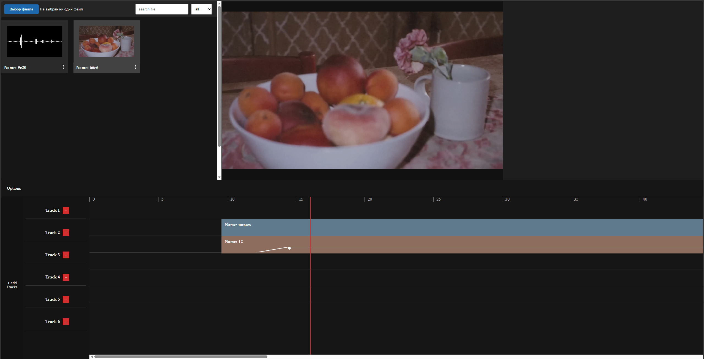

<div align="center">
  
  <h1>Apollo</h1>
  <p>A non-linear desktop video & audio editor built with React and Electron.</p>

  <p>
    <a href="docs/README.en.md">English</a> · <a href="docs/README.ru.md">Русский</a> · <a href="docs/README.zh.md">简体中文</a>
  </p>

  <p>
    
    
    
    
    
  </p>

  <!-- SCREENSHOT: replace with real app screenshot -->
  
</div>

---

## Features

- **Multi-track timeline** — arrange video, audio, and image clips across unlimited tracks
- **Real-time preview** — frame-accurate playback with layer compositing
- **Drag & drop import** — drop files straight onto the canvas or the timeline
- **Clip trimming** — resize clips from either edge with frame-accurate handles
- **Audio fades** — per-clip fade-in / fade-out curves
- **Track management** — add, rename, and delete tracks on the fly
- **Zoom** — scroll to zoom the timeline ruler in/out

## Quick start

```bash
git clone https://github.com/your-org/apollo.git
cd apollo
npm install
npm run start        # Electron + Vite dev server
```

> Requires **Node.js 18+**

```bash
npm run dev          # browser only (no Electron)
npm run build        # production bundle
```

## Tech stack

| | |
|---|---|
| UI | React 19 + TypeScript |
| Bundler | Vite 8 |
| Desktop | Electron 41 |
| Styling | SCSS |
| File drop | react-dropzone |

## Project structure

```
src/
├── components/
│   ├── TimeLine/        # timeline, tracks, clips, playhead
│   └── Preview/         # preview canvas + layer compositor
├── context/
│   ├── ClipContext/     # assets, tracks, clip state
│   ├── CurrentTimeContext/
│   └── PreviewContext/
└── utils/               # hooks: drag, resize, zoom, sync
electron/
└── main.ts              # BrowserWindow bootstrap
```

## Contributing

Pull requests are welcome. For major changes please open an issue first.

---

<div align="center">
  <sub>Made by <a href="https://github.com/Starodybczev">Starodybvzev</a></sub>
</div>
